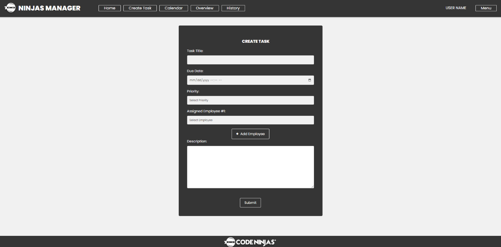

<div align="center">

# CtrlAltDelete 
https://johnvardanyan.github.io/CtrlAltDelete/ 

<a href="https://github.com/johnvardanyan/ctrlaltdelete">
  
</a>

</div>

## Synopsis

NinjaManager is a web-based task management application tailored for the administrative team at Code Ninjas, owned by Lego Haryanto. This tool is designed to efficiently handle day-to-day administrative tasks, including membership adjustments, customer request management, and task tracking.

The application is built to integrate seamlessly with the existing Code Ninjas Dashboard, ensuring familiarity and ease of use for employees. Key functionalities include a straightforward task creation system, a comprehensive calendar view for tracking due dates, and a dynamic task status indicator to monitor progress, past due, or completed tasks.

NinjaManager offers a clean, user-friendly interface with essential navigation options such as “Home”, “Create Task”, “Calendar”, “Overview”, and “History”. Each section provides specific functionalities - from displaying current tasks on the Home page to a detailed history of completed tasks. The task management process is streamlined, allowing for easy assignment of tasks to employees, setting priorities, and editing task details.

With NinjaManager, the Code Ninjas administrative team can effectively track and manage tasks, ensuring timely responses and efficient operations. This application is a strategic step towards enhancing administrative efficiency, providing a simple yet powerful tool for day-to-day management.


<a href="https://github.com/johnvardanyan/ctrlaltdelete">
  
</a>

<a href="https://github.com/johnvardanyan/ctrlaltdelete">
  
</a>

## Installation

### Prerequisites
Make sure you have the following installed on your machine:
- [Node.js](https://nodejs.org/) (version 18.18.1)
- [npm](https://www.npmjs.com/) (version 9.8.1)

### Installation

1. **Clone the Repository**
2. **Install Dependencies:**
   - In the backend directory, run:
     ```bash
     npm install
     ```
   - Backend dependencies include:
     - dotenv (version 16.3.1)
     - express (version 4.18.1)
     - mongodb (version 6.2.0)
     - mongoose (version 7.6.3)
     - update (version 15.0.4)
     - nodemon (version 3.0.1) (installed globally)
  - Frontend dependencies include:
     - @testing-library/jest-dom (version 5.17.0)
     - @testing-library/react (version 13.4.0)
     - @testing-library/user-event (version 13.5.0)
     - react (version 18.2.0)
     - react-datepicker (version 4.21.0)
     - react-dom (version 18.2.0)
     - react-router-dom (version 6.17.0)
     - web-vitals (version 2.1.4)

3. **Configuration:**
	
Database set-up:
- Go to https://www.mongodb.com/atlas/database and create a free database using the following options: 
	- Shared cluster (free) 
	- Cloud Provider: AWS 
	- Region: Any
  
- After creating the database, navigate to ‘Quickstart’ under the ‘Security’ section and create a user.
- Next, navigate to ‘Network Access’ and add your IP address.
  
To get your URI that will be used in the next step, navigate to ‘Database’ under ‘Deployment’. Locate your database and click on ‘Connect’. A pop-up window will appear. In this pop-up window, select the ‘Drivers’ option. Your database’s URI should be visible now. Copy it as it will be used in the next step.

Mailtrap set-up:
- Go to https://mailtrap.io/ and create a free mailtrap account.
- After creating an account, click on "Sending Domains" located on the left menus.
- Add your domain and verify to start sending emails.

Once your domain is set-up, you will be able to find your mailtrap USER_NAME and PASSWORD on that same page or in settings. Add the following information using the Environment set-up below.

NinjaManager Roles set-up:
NinjaManager currently has 3 roles: employee, admin, and owner. Both owner and admins can assign admins to employees using the "users" dropdown menu which allows users with those roles to delete tasks from the "History" page, however, only the Owner can remove admin privileges and remove users from the database. To assign ownership, you can do one of the 2 options:
- During your `.env` file setup, input your email for the variable "OWNER_EMAIL" BEFORE account creation, or
- Creating the FIRST account after pulling this code will automatically assign ownership.

Environment set-up:
- Create a `.env` file in the backend folder.
- Add your environment variables to the `.env` file.

  Example:
  
     	PORT=4000
     	MONGO_URI=mongodb+srv://<username>:<password>@mernapp.l0dhnve.mongodb.net/?retryWrites=true&w=majority
        OWNER_EMAIL="owner_email@gmail.com"
        DOMAIN_NAME="http://name_of_website.com"
        SECRET=randomsecrethashedwordthatissecurectrlaltdelete
        EMAIL_VERIFICATION_SECRET=randsecretemailverifwordctrlaltdelete
        EMAIL_USERNAME="mailtrap_username"
        EMAIL_PASSWORD="mailtrap_password"
      
      
Replace `<username>` and `<password>` with your actual credentials.
Replace `OWNER_EMAIL` with your email.
Replace `EMAIL_USERNAME` and `EMAIL_PASSWORD` with your mailtrap username and password.

4. **Connect to Backend Server, Database, and starting Development Server:**
   - In the terminal, run the following command in the root directory:
     ```bash
     npm start
     ```

5. **App Startup:**
   - The app should start up.


# Deployment
### Please refer to the following software and system requirements to ensure your machine can support our application.

Software Requirements:
- Node Js: v18.18.2. or later
- Studio Visual Code: 1.88.1 or later
- Any Compatible Browsers: Chrome, Safari, Edge, Firefox, etc
- Cloned CtrlAltDelete Repository folder

System Requirements
- Windows: 10 or later
- MacOS: X High Sierra or later
- 1.6 GHz or faster processor
- 1 GB of RAM


Follow the steps below to deploy this project locally on your machine:
1. Open Studio Visual Code.

2. Go to File and click on Open Folder.

3. Locate your CtrlAltDelete Repository (https://github.com/johnvardanyan/ctrlaltdelete) folder and click on Open.

4. Once opened, navigate to Terminal.

5. Click anywhere inside the Terminal and input the following command: `npm start`

6. Next, you should see mongoDB local server start on port 8000 & local host should open on default browser on port 3000.

# Testing

IDE: Visual Studio Code (version 1.89.0)

Testing Software:

- Jest (version 29.7.0)

- Selenium (webdriver version 4.19.0)

Operating System: Windows 10 OS (19045.4291) version 22H2

Jest Configuration:

Open a terminal by selecting Terminal + New Terminal in the upper left-hand corner of the IDE. Make sure you are in the repository's main file (CtrlAltDelete).
- Enter jest –init
   - When prompted, enter in or choose the following:
	Y
	Y
	Jsdom
	Babel
	Y

jest –init will have created a jest.config.js file. Please ensure the following configurations are set: 

	const config = {
	clearMocks: true,
	collectCoverage: true,
	setupFilesAfterEnv: ['./jest.setup.js'],
	moduleNameMapper: { '\\.(css|less|scss|sass)$': 'identity-obj-proxy' },
	transform: { '^.+\\.(js|jsx|ts|tsx)$': ['babel-jest', { configFile: "./babel.config.js" }] },
	coverageDirectory: "coverage",
	testEnvironment: "jest-environment-jsdom",
	verbose: true,
	};

- Create a jest.setup.js file with the following:
```
	global.fetch = jest.fn((url, config) => {
	// Mock responses based on URL
	if (url.includes('/api/user/employees')) {
	// Respond with an empty array of employees or whatever is appropriate for your tests
	return Promise.resolve({
	ok: true,
	json: () => Promise.resolve([]),
	});
	}
	// You can add more conditions for other API endpoints
	// ...
	// Default to rejecting fetch calls that aren't explicitly mocked:
	return Promise.reject(new Error(`Unmocked endpoint: ${url}`));
	});
	});
	afterEach(() => {
	global.fetch.mockClear();
	});
	afterAll(() => {
	global.fetch.mockRestore();
	});
```
- Enter npm install –save-dev jest

- Enter npm install --save-dev jest-environment-jsdom

- Enter npm install --save-dev identity-obj-proxy

- Enter npm install node-fetch@2

- Enter npm install jest-fetch-mock --save-dev

- All test files should be placed in CtrlAltDelete/Frontend/Src/Pages. All Jest testing files have the following naming convention: <filename>.test.js. 

- To run all test files, enter “npm test.” To run a specific file, enter “npm test <test file name>”

Selenium Configuration:

Open a terminal by selecting Terminal + New Terminal in the upper left-hand corner of the IDE. Make sure you are in the repository's main file (CtrlAltDelete).

- Enter npm install selenium-webdriver

- Enter npm install chromedriver

- All test files should be placed in CtrlAltDelete/Frontend/Src/Pages. All Selenium testing files have the following naming convention: <filename>SeleniumTest.js.

- To run a selenium test, open a new terminal in VSCode by selecting Terminal + New Terminal in the upper left-hand corner. In the main directory (CtrlAltDelete), start the application by entering “npm start.”

- Open another terminal by selecting Terminal + New Terminal in the upper left-hand corner of VSCode. Navigate to CtrlAltDelete/Frontend/Src/Pages (where test files should be located). To run a test file, enter “node <filename>SeleniumTest.js”

# Developer Instructions
Required Software: 
- Any IDE that is capable of editing, creatng, and running a react application. 
- Preferred IDE: Visual Studio Code (version 1.89.0 or later) 

Required Libraries: 
- All dependencies are built-in to the application.  
- Run “npm install” to install all required libraries specified in package.json 

Frontend Dependencies: 
- React (Router DOM, Big Calendar, Datepicker, Icons, Scripts), Axios, Validator, Web Vitals, Testing Library  

Backend Dependencies: 
- Node.js, Express.js, Bcrypt, CORS (Cross-Origin Resource Sharing), Dotenv, JsonWebToken (JWT), Mongoose, Node-Cron, Nodemailer, Nodemon, Moment-Timezone, Query-String  

Coding Standards: 
- Function names should be self-explanatory 
- Follow consistent spacing and indentation according to Prettier and ESLint rules 
- Use camelCase for variables and functions 
- Use PascalCase for component names 

Style Guidelines: 
- High Priority: #ffad99 
- Medium Priority: #f3f899 
- Low Priority: #adebad 
- Background Styling should adhere to CodeNinjas Dashboard standards 
 
- Project’s File Structure and Organization:
	- Backend Directory: 
		- Controllers: Contains controller files like taskController.js and userController.js that handle HTTP requests and responses. 
		- Middleware: Holds middleware functions such as requireAuth.js and user.js for request handling. 
		- Models: Includes schema definitions and model logic files like taskModel.js and userModel.js. 
		- Routes: Defines RESTful API routes in files like tasks.js and user.js. 
		- Server.js: The main entry point of the backend application. 

 	- Frontend Directory: 
		- Public: Static files like the main HTML template and assets. 
 			 - Src: 
				- Components: Contains reusable React components for different UI parts. 
				- Context: Manages global state and context providers for the application. 
				- CSS: Holds all CSS files for styling different components and pages. 
				- Hooks: Custom hooks like useAuthContext.js and useTasksContext.js. 
				- Pages: Complete pages for the app, such as Login.js, Home.js, and Profile.js. 
				- App.js: The main entry point of the frontend application. 

# Timeline

### Key Milestones in CSC 190:
- [x] Front-end Homepage
- [x] Front-end Create task page
- [x] Front-end Calendar page
- [x] Front-end Overview page
- [x] Front-end History page
- [x] Setup Back-end MongoDB
- [x] Setup Back-end Task Schema
- [x] Task creation Functionality
- [x] Setup Task creation to MongoDB

### Key Milestones in CSC 191:
- [x] Backend-end functionality to pages
- [x] Profile/User database
- [x] Account Creation and Login
- [x] Email verification for account creation and change/reset password
- [x] Admin privledges
- [x] Users page for list of users to assign and deassign admins
- [x] Linked Profile with Tasks  
- [x] Added a "Completed" button on Overview page that sends to History Page
- [x] Added a "Deleted" button on History page that sends to History Page
- [x] Tasks on Calendar page with editing functionality
- [x] Fully functional web pages


# Credits

Meet the Team:
- John Vardanyan | johnvardanyan@gmail.com | https://github.com/johnvardanyan | www.linkedin.com/in/nairy/
- Elina Grigoryan | elina.grigoryan8@gmail.com | https://github.com/egrigoryan12 | www.linkedin.com/in/elina-grigoryan
- Ashley Palencia – Wisniewski | ashleypalencia-wisn@csus.edu | https://github.com/AshleyPW | www.linkedin.com/in/ashleypalencia
- Jeremy Vuong | jeremyvuong@csus.edu | https://github.com/JxRRRm | https://www.linkedin.com/in/jeremy-vuong-5a1158178/
- Arjun Bhargava | abhargava@csus.edu | https://github.com/NightWolfz2
- Navid Baghaei  |  Navid1.Baghaei@gmail.com | https://github.com/NavidBaghaei | https://www.linkedin.com/in/navid-baghaei-7346602a2/
- Madusha Yakupitiyage | madushayaku@gmail.com | https://github.com/Madusha0909 | https://www.linkedin.com/in/madusha-yakupitiyage-99b202269/ 
- Nikolay Chkhaylo  | nchkhaylo@gmail.com | https://github.com/NikolayChkhaylo 

# License

All rights are observed. This project is not open source.
